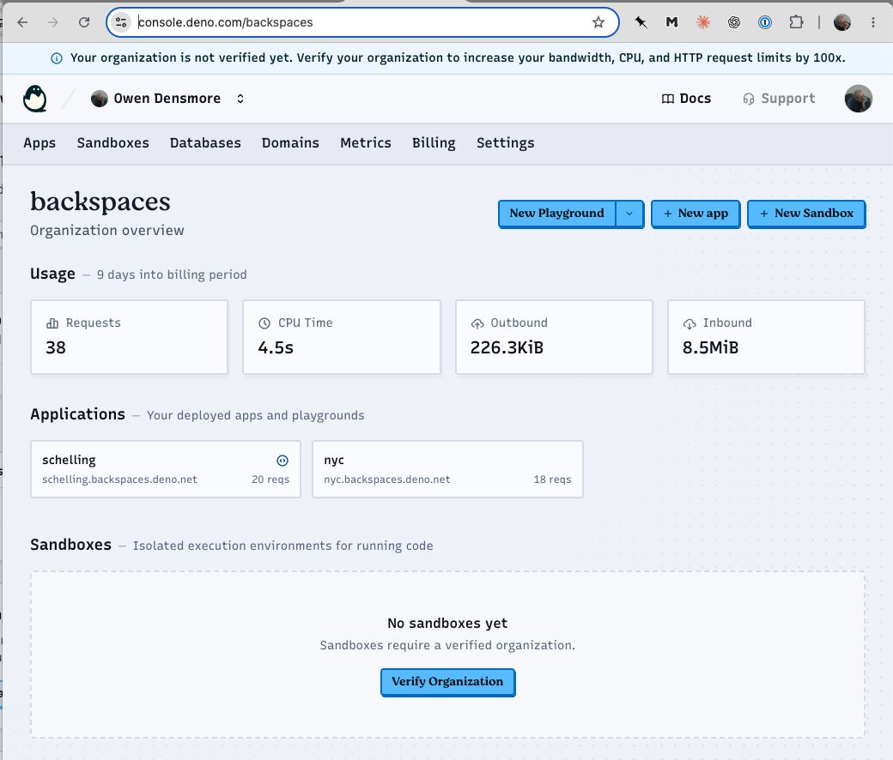

# Deno Deploy

**Live demos:** [nyc.backspaces.deno.net](https://nyc.backspaces.deno.net), [voronoi.backspaces.deno.net](https://voronoi.backspaces.deno.net) (Apps, via CLI), and [schelling.backspaces.deno.net](https://schelling.backspaces.deno.net) (Playground, via dashboard) — all deployed below, click to see them running.

Notes on Deno's hosting platform, as an alternative/companion to the
[agentscript.acequia.io](../README.md) WebDAV publishing used for the rest of
`Apps/`. Written while getting a first app deployed for real — see
[Getting a deploy working](#getting-a-deploy-working) below for open items.

## Classic vs. new Deno Deploy

There are two, unrelated platforms sharing the "Deno Deploy" name:

| | Classic | New (current) |
|---|---|---|
| Dashboard | `dash.deno.com` | `console.deno.com` |
| Model | flat, per-project | org-based |
| Status | shut down (sunset was July 20, 2026) | active |

**They do not share data.** Classic projects were never auto-migrated, and
`dash.deno.com` now just redirects to `console.deno.com`. An old Classic
account/login carries over (email, GitHub link, even a plausible org slug
suggestion), but any old Classic *apps* are gone unless you still have the
source elsewhere.

## Getting started (new account)

Start at [docs.deno.com/deploy](https://docs.deno.com/deploy/) — the "About
Deno Deploy" page links to the dashboard and the rest of the reference docs.
Per Deno's own quickstart, the path is:

1. Visit `console.deno.com` and sign in (GitHub or Google) — this creates
   your personal Deno account.
2. Create a Deno Deploy organization (`console.deno.com/orgs/new`) — apps
   live inside an org, not directly on your personal account, so this step
   is required before you can deploy anything.
3. Create your first application within that organization.
4. Deploy it — from a connected GitHub repo, directly from the dashboard
   (a Playground), or from the CLI (see below).

What we actually saw doing this, worth knowing in advance:

- Signing in alone does **not** skip org creation — even though your
  personal account exists, `console.deno.com` redirects straight to
  `orgs/new` until at least one org exists.
- The org-slug field may pre-fill a suggestion (in our case it remembered
  `backspaces`, a slug from an old Classic-era account) — that's just a
  suggestion carried over with your login, not evidence anything already
  exists under the new system. Any available slug works.
- A freshly created org starts **unverified** ("Your organization is not
  verified yet") — verifying raises bandwidth/CPU/request limits by 100x,
  but unverified is fine for small demos/testing. Verifying just means
  adding a payment method at `.../~/billing/verify` — Deno states outright
  it won't be charged, and even past the (much higher) verified limits,
  apps simply stop serving traffic rather than incurring a bill. Purely
  optional for personal-scale use.
- Account-level settings (name, email, linked GitHub/Google, personal
  access tokens) live separately at `console.deno.com/account`, distinct
  from any org's settings.

The dashboard itself is **private** — visiting `console.deno.com/backspaces`
while logged out (or in an incognito window) just shows a sign-in screen,
no org/app data leaks. So for anyone without a login, here's what the org
overview page looks like:



(Org display name was later renamed from the default "Owen Densmore" to
match the slug, "Backspaces" — the CLI walkthroughs below still show the
old name since they're transcripts from before that change.)

## Inviting teammates

Since the dashboard is private, viewing a *deployed app* needs no invite at
all — the live `.deno.net` URLs are public to anyone with the link. Invites
are only needed for someone who has to log into `console.deno.com/backspaces`
itself, e.g. to edit the `schelling` Playground in-browser, run their own
`deno deploy` CLI commands against this org, or see metrics/logs/billing.

Invite from `console.deno.com/backspaces/settings` → **"+ Invite User"**
→ their GitHub username (email optional, pulled from GitHub if blank).

**Caveat:** there's currently no restricted/view-only role — per Deno's
docs, "all members have owner permissions," so an invite makes someone a
full co-owner (can create/delete apps, manage domains, invite/remove other
members), not a scoped collaborator. Worth reserving invites for actual
collaborators rather than people who just want to look at a demo. The new
console is still Early Access, so scoped roles may show up later — nothing
indicates it's in progress as of this writing.

## Playground vs. App vs. Sandbox

The new console offers three different things under "+ New ___":

- **Playground** — write/edit/deploy entirely from the browser, no GitHub
  repo needed. Supports multiple files and zip upload. Good for prototyping;
  not meant as the stable home for something you'll keep updating from a
  local folder, and it can't be transferred to another org later.
- **App** — the production unit: one build config, build history, env vars,
  deploy history. Deploy from a GitHub repo (auto-rebuild on push) **or**
  from the CLI with `--source local` — GitHub is not required. This is the
  better fit for the static, no-build HTML/JS folders in this repo.
- **Sandbox** — isolated microVMs for running untrusted/dynamic code (e.g.
  AI agent workloads). Not a hosting mechanism — unrelated to publishing a
  demo.

For folders like the ones in `Apps/` (self-contained `index.html`, CDN
imports, no build step), **App via CLI** is the closest match to what
`uploadApps.js` already does for WebDAV.

## The `deno deploy` CLI

Built into Deno 2.9+ (auto-downloaded from JSR on first use — no separate
install). Run from inside the specific app folder you want to deploy, e.g.:

```sh
cd Apps/NYC
deno deploy --org backspaces
```

Key things learned the hard way:

- **Org defaults silently.** Without `--org`, it can default to your
  personal account org instead of prompting — always pass `--org <name>`
  explicitly.
- **The "Select an application" list is org-wide, not folder-scoped.** It
  shows every app that already exists in the org regardless of which
  directory you're standing in. The current directory only determines what
  gets *uploaded* once you pick "Create a new application" (or an existing
  one to redeploy over). Running `deno deploy` from a parent folder (e.g.
  `Apps/` itself) would deploy the *entire* tree as one app — always `cd`
  into the specific app folder first.
- **First run needs a real terminal.** Auth is a browser device-code flow
  (visit a URL, approve). It needs an interactive TTY, so it can't be driven
  from a non-interactive/sandboxed shell — run it in your own terminal.
- **Ctrl+C can be flaky** mid-prompt (Cliffy-based interactive UI). If one
  Ctrl+C doesn't cancel, try it twice, try Ctrl+D, or just close the
  terminal tab / `pkill -f "deno deploy"` from another window.
- **Delete an app in the dashboard → delete its local `deno.jsonc` too.**
  If you delete an app (e.g. via its Settings page) but leave the folder's
  `deno.jsonc` pointing at it, the *next* `deno deploy` skips the normal
  interactive picker and tries to deploy straight to the now-gone app,
  failing with `The requested app was not found, or you do not have access
  to view it.` — even `deno deploy whoami` can fail with a confusing
  `Already re-attempted authorization` error in this state. The persistent
  "Unable to interact with keychain" warning on every run is unrelated/
  benign (just means auth isn't cached between invocations) — don't chase
  that when this is the actual cause. Fix: `rm deno.jsonc` in the app
  folder, then re-run.

Useful subcommands:

```sh
deno deploy whoami                          # check current auth/org
deno deploy create --org <org> --app <name> \
  --source local --runtime-mode static --static-dir . \
  --json --non-interactive                  # scripted/CI-style create
deno deploy --org <org> --app <name> --prod # redeploy over an existing app
```

For CI/scripted use: set `DENO_DEPLOY_TOKEN` and pass `--json
--non-interactive` — emits a single JSON object on stdout, a structured
error envelope on stderr, and stable exit codes (0 OK, 1 GENERIC, 2 USAGE,
3 AUTH, 4 NOT_FOUND, 5 CONFLICT, 6 NETWORK).

Production URL shape: `https://{app-slug}.{org-slug}.deno.net`.

## First deploy: `NYC`, step by step

`NYC` is now live at `https://nyc.backspaces.deno.net`, deployed via the CLI
from `Apps/NYC` with no GitHub repo involved. Full interactive sequence, for
next time (each `Select ...` / bracketed step is an up/down-arrow menu, not
free text — only type where a value is actually shown being entered):

```sh
cd Apps/NYC
deno deploy --org backspaces
```

1. Browser opens for device-code auth (only needed again if the CLI hasn't
   cached credentials — it didn't for us, see the Ctrl+C/keychain note
   above; each new run re-prompted).
2. `Select an application:` → **Create a new application**
   (not the leftover `graceful-blackbird-6334` Playground).
3. `app name:` → typed `nyc` (lowercase, hyphens only — same slug rules as
   everywhere else in the console).
4. `Do you want to deploy from a github repo or locally?` → **local**.
5. `Select an app directory:` → **(root) (no preset)** — correct for a bare
   `index.html` with no build step.
6. `Do you want to use the detected build configuration? [y/N]` → **y**.
   Detected config: no preset, no install/build/pre-deploy commands,
   runtime mode **static**, static directory `.`, not a single-page app.
7. Build timeout → default **5 minutes** (irrelevant, no build step).
8. Build memory limit → default **1 GB** (irrelevant, no build step).
9. Regions → default **us**.
10. `Create app? [y/N]` → **y** — uploads files and deploys.

Result: production URL `https://nyc.backspaces.deno.net`, a per-revision
preview URL, and a **`deno.jsonc` config file written into `Apps/NYC/`**:

```jsonc
{
  "deploy": { "org": "backspaces", "app": "nyc" }
}
```

That file means future redeploys from `Apps/NYC` don't need `--org`/`--app`
again — just:

```sh
cd Apps/NYC
deno deploy --prod
```

## Second deploy: `schelling`, a Playground

Unlike `nyc` (an App via CLI), `schelling` is a **Playground** — created
through the dashboard, not the CLI, since Playgrounds don't have a `--source
local` equivalent. Live at `https://schelling.backspaces.deno.net`, source
mirrored at [../Schelling/README.md](../Schelling/README.md).

Steps that differed from the CLI/App flow:

1. `console.deno.com/backspaces` → **"+ New Playground"** (the plain
   button, not a framework template). This creates an app with a
   placeholder name (e.g. `eerie-quetzal-5108`) and a single starter file,
   `main.ts`, containing a trivial `Deno.serve(() => new
   Response('Hello, Deno!'))`.
2. **Playgrounds run a server script, not a static directory** — there's no
   "runtime mode: static" option like Apps have. So instead of dropping in
   a bare `index.html`, the pattern is:
   - Add a new file via the Explorer panel's "new file" icon, named
     `index.html`, containing the actual page.
   - Replace `main.ts` with a tiny server that reads and serves it:
     ```ts
     const html = await Deno.readTextFile("./index.html")
     Deno.serve(() => new Response(html, { headers: { "content-type": "text/html" } }))
     ```
3. Click **Deploy** (top right) — the Preview pane on the right shows it
   live immediately, plus a shareable `{slug}.backspaces.deno.net` URL.
4. Renamed via **Settings** (top bar) from the placeholder slug to
   `schelling` — same slug-editing UI as the leftover
   `graceful-blackbird-6334` Playground we found earlier.

The source itself (AgentScript's `SchellingModel` + `GUIDiv` controls) came
from `src/agentscript/views2gui/schelling.html`, with its four imports
changed from local relative paths (`/src/Animator.js`, etc.) to the
`https://agentscript.org/...` CDN, since a Playground has no access to
files outside itself.

`Voronoi` followed the exact same App-via-CLI steps as `NYC` (also a bare
`index.html`, no build step) — live at `https://voronoi.backspaces.deno.net`,
with its own `deno.jsonc` written into `Apps/Voronoi/`.

## Third demo: `SchellingLive`, using Tunnel

**Tunnel** is different from everything above — it exposes a **locally
running** server to a public URL, rather than hosting pre-built/static
content. Per Deno's docs: `deno run --tunnel -A main.ts` — first run
authenticates via the same browser device-code flow as the CLI, asks which
app to associate the tunnel with, then prints a public URL forwarding to
your local process. Meant for testing webhooks, sharing local dev with
collaborators, or (our case) live demos of something with real server-side
state that a static file can't provide.

Full writeup and code at [../SchellingLive/README.md](../SchellingLive/README.md)
— short version: instead of each visitor running their own independent
client-side copy of the Schelling model (like the `schelling` Playground
does), one instance runs server-side and broadcasts ticks to every
connected browser over Server-Sent Events, so everyone watches the same
live grid, and anyone's click (or a shared Restart button) affects it for
everyone at once. Confirmed `SchellingModel` runs fine headless under plain
`deno run` — no DOM/browser dependency in the model logic itself, only in
its `TwoDraw` renderer (which this demo doesn't use — it draws straight to
a `<canvas>` from the SSE state instead).

### Creating the app for a dynamic script (not static)

Unlike `nyc`/`voronoi` (bare `index.html`, auto-detected as **static**),
`SchellingLive` is a real `Deno.serve` script — accepting the auto-detected
config here would be wrong (it defaulted to "static," which would've just
served `index.html` with no backend behind it, breaking every `/events`,
`/toggle`, `/restart` call). At the "Do you want to use the detected build
configuration?" prompt, answer **N** instead, which walks through manual
config:

- Framework preset → **(none)**
- Install/build/pre-deploy commands → leave blank (no build step)
- Runtime mode → **dynamic app** (not "static site")
- Entrypoint → `server.ts`
- Arguments / working directory → leave blank

That deploys it as a real, permanently-running dynamic app — confirmed
live and actually streaming real SSE data at
`https://schellinglive.backspaces.deno.net/events`, no tunnel required.
Bonus: this means `SchellingLive` now also works as an always-on shared
demo on its own, independent of Tunnel — Tunnel is still worth showing
separately since it demonstrates a different thing (your own laptop
serving it live), but isn't strictly required to make this demo work.

### Gotcha: `switch` and `--tunnel` can't create apps, only pick existing ones

`deno deploy` (bare, for creating something new) offers "Create a new
application" in its app-picker. `deno deploy switch --org <org>` and
`deno run --tunnel` do **not** — they only list existing apps. So to tunnel
into a brand-new app, create it first with the normal `deno deploy` flow
(as above), *then* run `switch`/`--tunnel` and pick it from the list.

Also: `deno deploy switch --org <org>` writes a `deno.jsonc` into whatever
folder you happen to run it from, pointing at whichever app you picked —
if you run it from an unrelated folder (we ran it from `SchellingLive/`
but picked `nyc` just to complete the org switch), it leaves a **wrong**
`deno.jsonc` behind pointing that folder at the wrong app. Delete/fix it
before deploying from that folder for real.

### Gotcha: the Tunnel device-auth can sign you into an entirely different account

Mid-way through this, `deno run --tunnel`'s browser auth landed on a
**different Deno account** than the one used everywhere else — same
display name ("Owen Densmore"), but a different underlying identity
(`odensmore@gmail.com` via Google, vs. the usual `owen@backspaces.net` via
GitHub). It had zero access to `backspaces`, producing confusing errors
one level up (`ORGANIZATION_NOT_FOUND`, `The requested app was not found`,
even a JSON-parse crash on `whoami`).

How to tell: check `console.deno.com/account` and compare the **email**
shown, not the name. How it happened isn't fully clear (likely the browser
auto-selecting a signed-in Google session instead of prompting), but the
fix:

1. `deno deploy logout` only clears the **CLI's** local token — it does
   **not** sign you out of the browser's own `console.deno.com` session.
   Both need clearing.
2. Sign out in the browser too (avatar menu, top-right → **Sign out**).
3. Re-run the command, and when the sign-in page appears, explicitly
   choose the right provider (**GitHub**, in our case) rather than
   whatever the browser suggests by default.
4. Separately: being a member of more than one org (we'd accepted a
   teammate's invite to `redfish` at some point) means the **browser's**
   current org and the **CLI's** current org are two independent bits of
   state — fixing one doesn't fix the other. Switch the browser's org via
   the org-switcher dropdown (top-left); switch the CLI's via
   `deno deploy switch --org backspaces`.

### Tunnel confirmed working end-to-end

`deno run --tunnel -A server.ts` from `SchellingLive/` ran cleanly (no
re-auth needed once the account/org mess above was sorted), connecting to
**`https://schellinglive--local.backspaces.deno.net`** — a third URL
pattern, distinct from both the production URL
(`schellinglive.backspaces.deno.net`) and the per-revision preview pattern
(`schellinglive-<revision>.backspaces.deno.net`) seen elsewhere. Confirmed
it's genuinely serving from the local process (live `/events` data matched
what the running terminal was doing), not the separate permanent
deployment — the two run fully independently, as noted in
[../SchellingLive/README.md](../SchellingLive/README.md).

Still open:
- Decide whether to add `deno.jsonc` files (and run the deploy) for the
  remaining app folders too (`Slideshow`, `ServiceWorkerDemo`, `CacheDemo`,
  `Blog`).
- Now that four apps are deployed this way, consider scripting repeat
  deploys — a `deno-deploy.js`/`.sh` sibling to `uploadApps.js`, looping
  `deno deploy --org backspaces --app <name> --prod` per folder.
- Decide whether Deno Deploy becomes a second publishing target alongside
  agentscript.acequia.io, or a replacement for specific apps.
- Decide on org verification (see above) — optional, currently unverified.
- Actually demo `SchellingLive` live to the team (Tunnel is confirmed
  working — this is now just about doing the demo itself).
